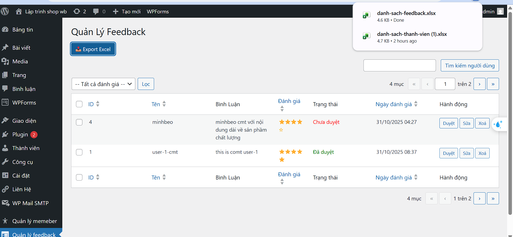
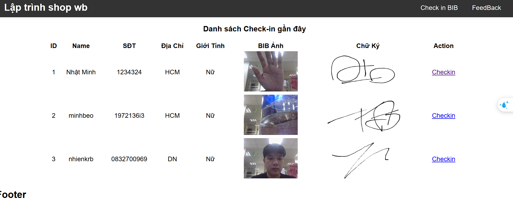
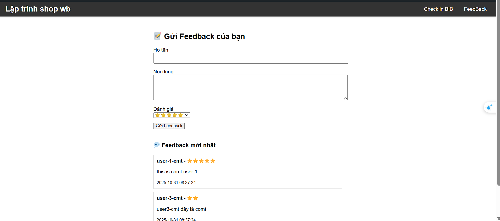
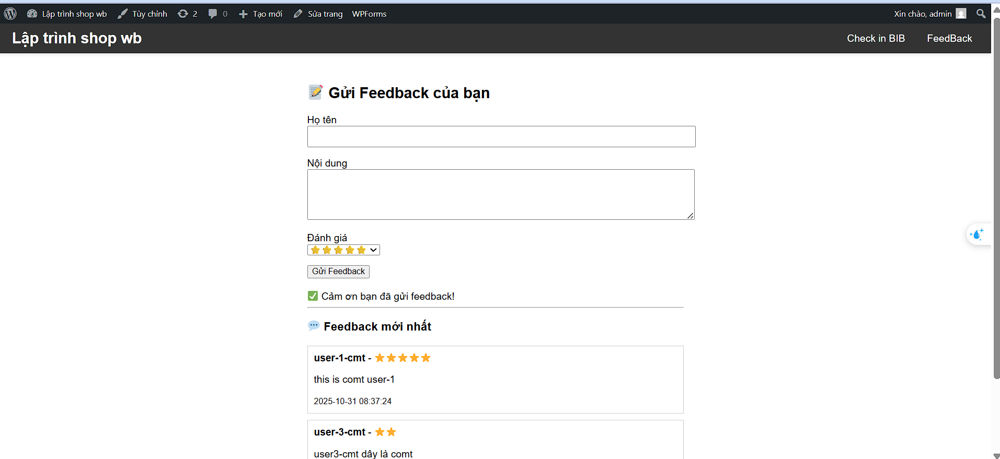
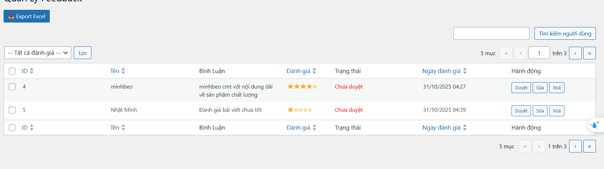

  <h3>Xuất file excel</h3>
  

---

  <h3>Giao diện gồm 2 chức Checkin & Feedback</h3>
  

---

  <h3>Giao diện feedback</h3>
  

  <h3>Giao diện đã gửi feedback</h3>
  

  <h3>Giao diện feedback đã gửi chưa duyệt</h3>
  

