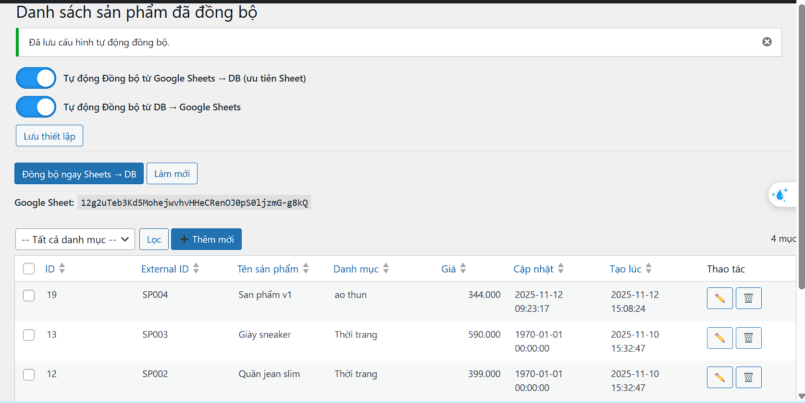

  <h3>Đồng bộ có chọn tab sheet</h3>

---

  <h3>Đồng bộ DB -> Sheet</h3>
  

---

  <h3>Đồng bộ</h3>
  

---

  <h3>( POST ) - API Đồng bộ có validate</h3>
  

---

  <h3>( GET ) - API Xem sheet</h3>
  

---

---

  <h3>Sheet</h3>
  

---
